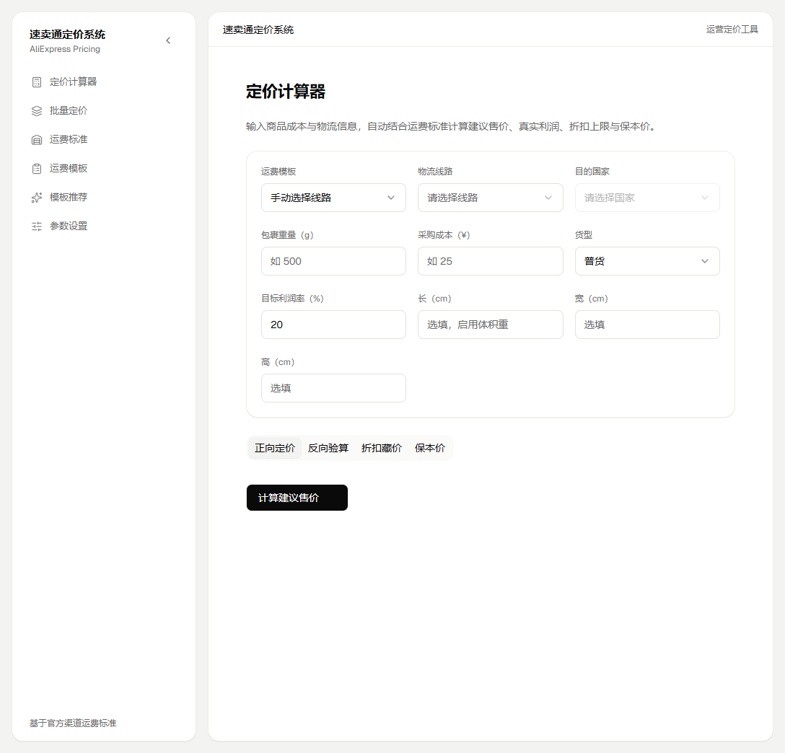
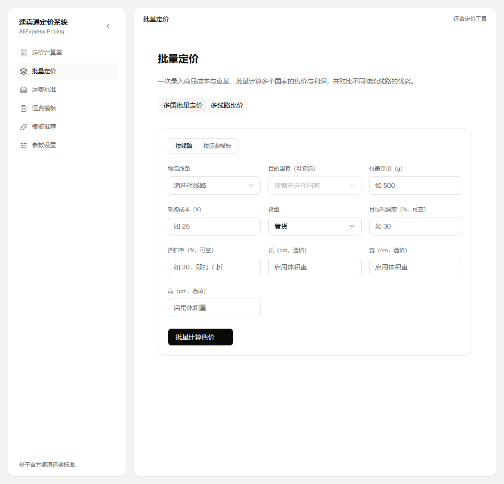
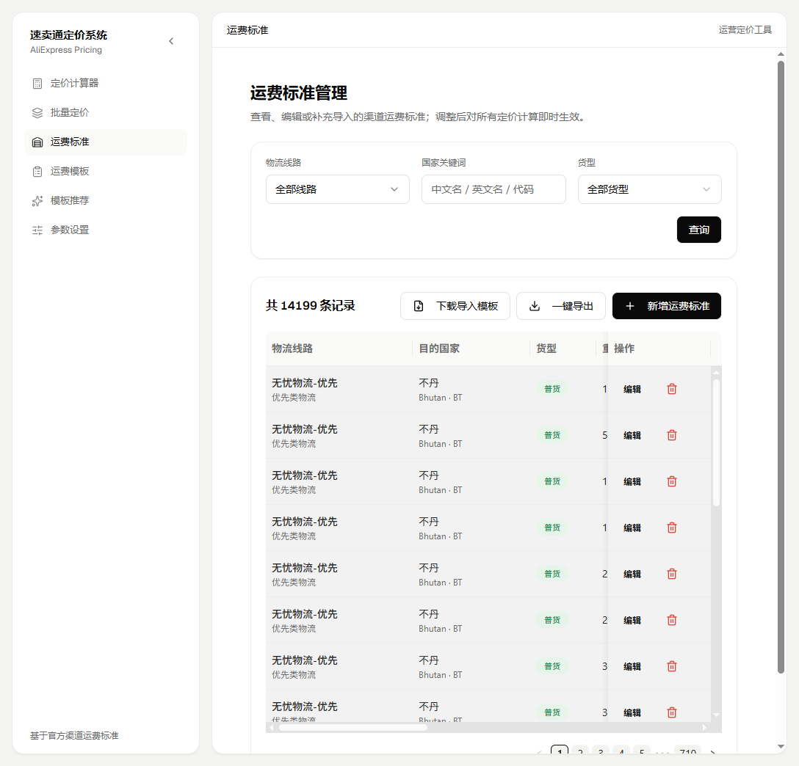
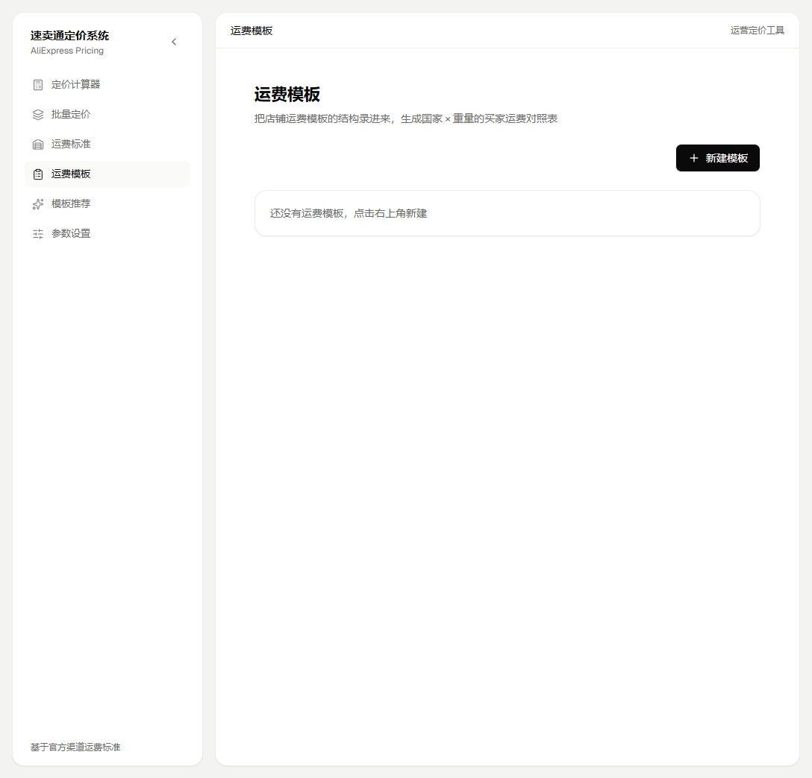
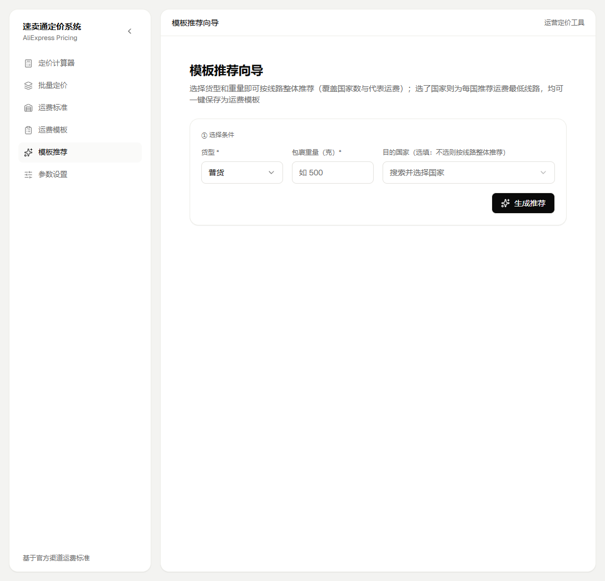
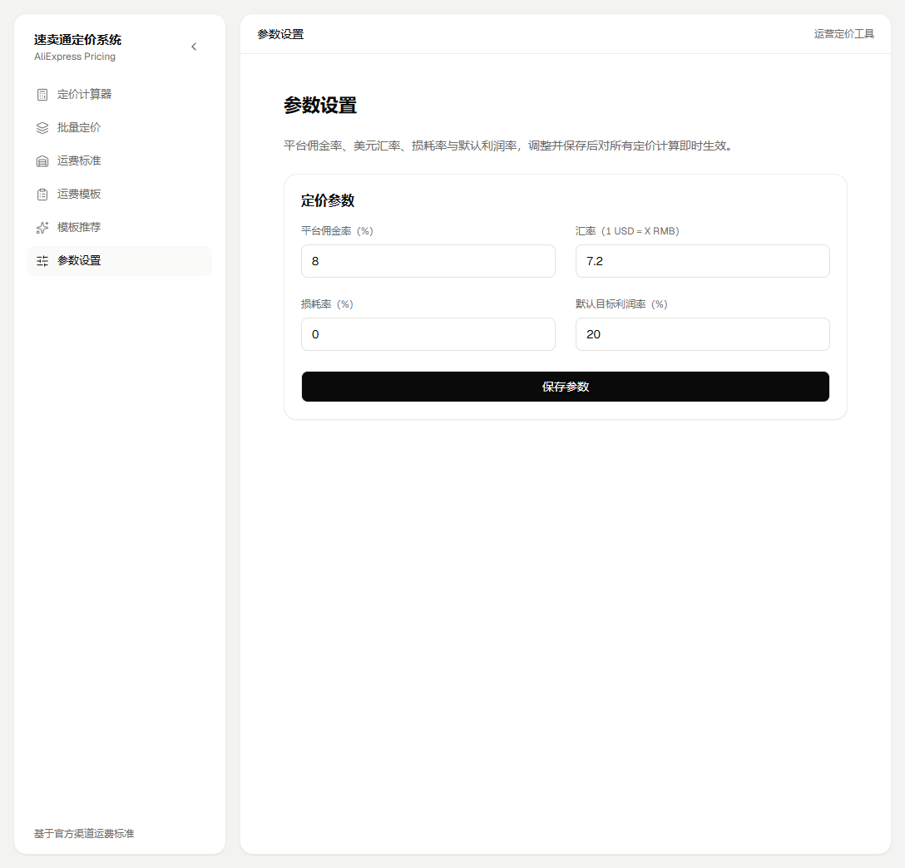

# 速卖通定价系统 (AliExpress Pricing)

基于官方渠道运费标准（21 条物流线路、200+ 国家）的速卖通卖家桌面定价工具，支持单次定价计算、多国批量定价、多线路比价、运费模板管理。

技术栈：Tauri (Rust + SQLite) + React + TypeScript + Vite + TailwindCSS，打包为 Windows 桌面 exe，无外部依赖，开箱即用。

## 功能一览

- **定价计算器**：正向定价、反向验算、折扣藏价、保本价，自动结合运费标准计算建议售价、真实利润、折扣上限
- **批量定价**：多国批量计算售价与利润，支持折扣率（标价藏折扣）；多线路比价自动推荐最优线路
- **运费标准**：内置 14,199 条官方渠道运费数据，按线路/国家/重量档查询
- **运费模板**：创建店铺运费模板（标准/免邮/减免%），生成国家×重量档买家实付运费对照表
- **模板推荐向导**：选货型+重量，自动推荐运费最低线路，一键保存为模板
- **参数设置**：佣金率、汇率、损耗率、默认利润率，全局可调

## 截图

### 定价计算器



### 批量定价



### 运费标准



### 运费模板



### 模板推荐向导



### 参数设置



## 定价口径

- **保本价(USD)** = 成本合计 / 汇率 / (1 - 佣金率 - 损耗率)
- **建议售价(USD)**（销售利润率口径）= 成本合计 / 汇率 / (1 - 佣金率 - 损耗率 - 目标利润率)
- **反向验算**：净收入 = 售价 × 汇率 × (1 - 佣金率 - 损耗率)；利润 = 净收入 - 成本合计
- **折扣上限**：给定划线价 L 与最低利润率 m，最大折扣% = 1 - (保本价(含m) / L)
- **批量折扣率**：传折扣率 d 后，划线标价 = 建议售价 / (1 - d)，折后到手价 = 建议售价
- **体积重**：长×宽×高×1000/体积重除数（g），计费重量 = max(实重, 体积重)

## 运行方式

### 直接使用（推荐）

下载 `AliExpress Pricing_x.x.x_x64-setup.exe`，双击安装即可。首次运行自动在 `%APPDATA%\ae-pricing\` 创建数据库并导入运费数据。

### 从源码开发

```bash
# 需要 Node.js 22+ 和 Rust
nvm use 22.16.0
pnpm install

# 一键启动开发模式
dev-start.bat

# 或手动：
pnpm exec vite          # 启动前端 dev server (localhost:5173)
cargo run --manifest-path src-tauri/Cargo.toml   # 启动 Rust 后端
```

### 打包 exe

```bash
build-exe.bat
# 产物：src-tauri/target/release/bundle/nsis/AliExpress Pricing_x.x.x_x64-setup.exe
```

## 技术架构

```
client/src/          React 前端（Vite + TailwindCSS）
src-tauri/src/main.rs  Rust 后端（rusqlite 内嵌 SQLite，含 Tauri commands + 内置 HTTP server）
database/rates-seed.json  运费种子数据（编译进 exe）
```

- 数据存储：SQLite 文件在 `%APPDATA%\ae-pricing\ae.db`
- 前端通信：Tauri 环境走 `invoke` IPC；浏览器环境自动 fallback 到内置 HTTP API（127.0.0.1:18080）
- 运费数据来源：速卖通官方渠道运费标准 Excel（21 个线路 sheet）

## 商务合作

扫码添加企业微信，申请备注「GITHUB」：


## License

CC BY-NC-ND 4.0 — 不可商用，禁止演绎，署名相同方式共享。
